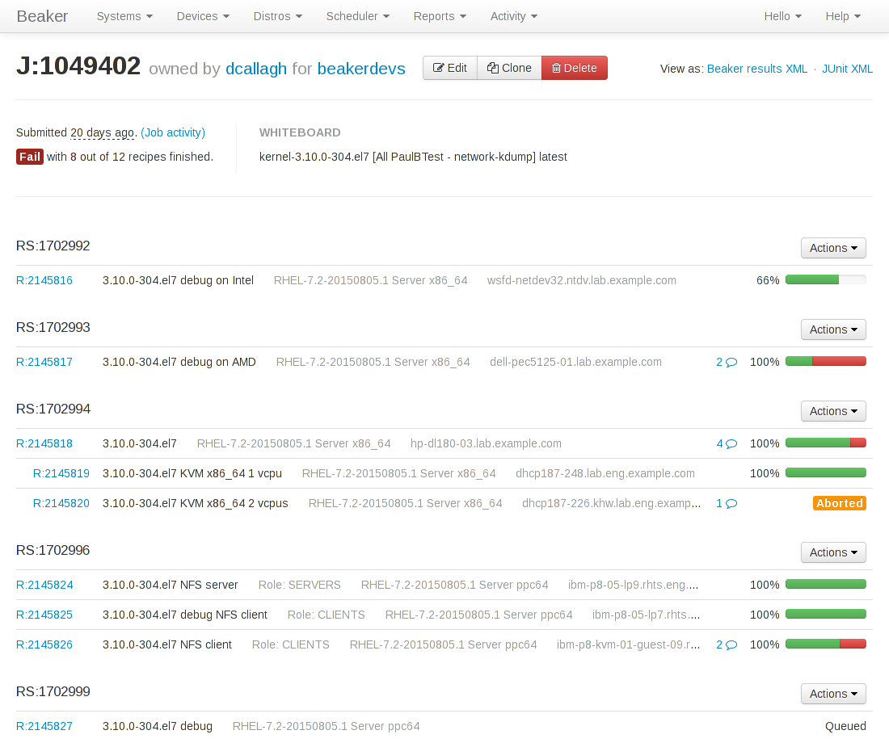
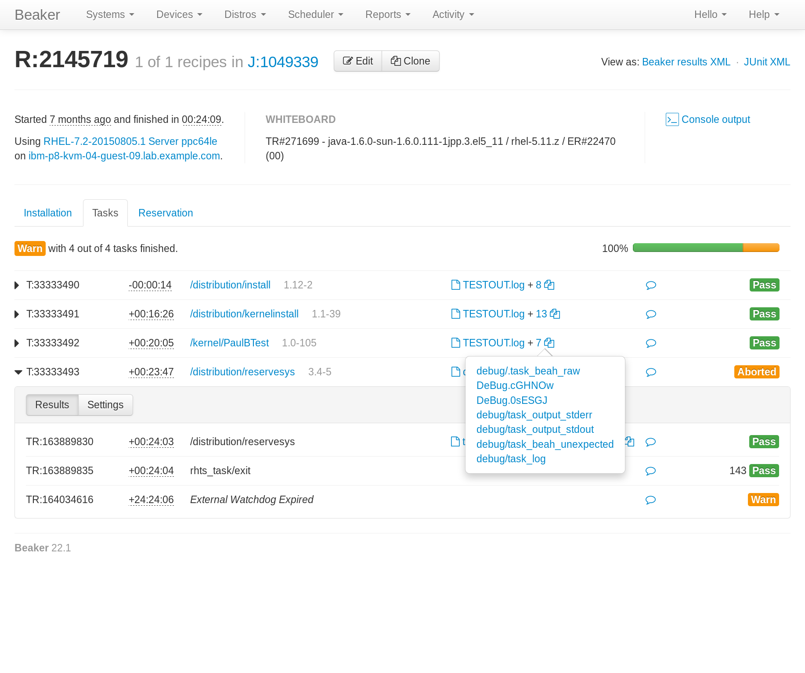
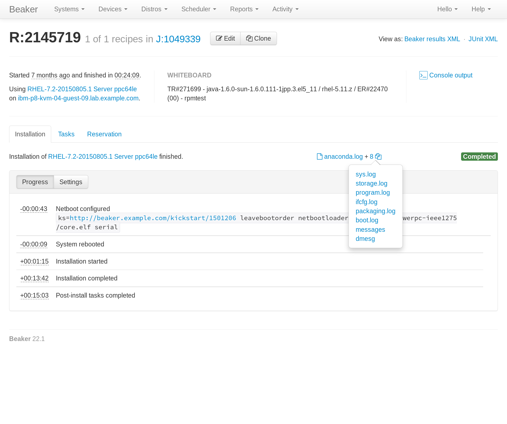
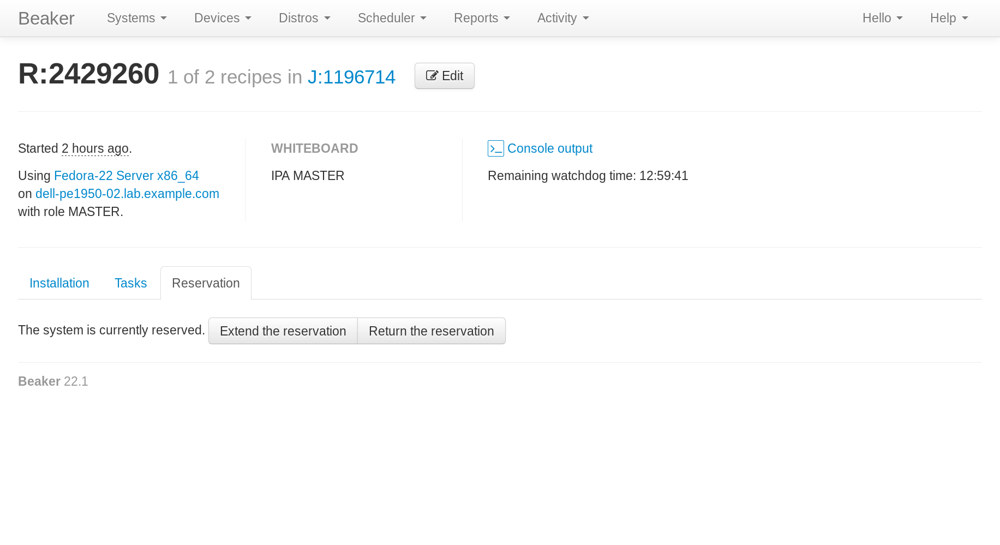

.. _proposal-job-page-improvements:

Job Page Improvements
=====================

:Author: Dan Callaghan
:Status: Implemented
:Release: 23

Background and rationale
------------------------

The *job page*, accessible at ``/jobs/<id>``, displays the details of a Beaker 
job and the recipes in it. Similarly the *recipe page*, accessible at 
``/recipes/<id>``, displays the details of an individual recipe. Both pages use 
the same underlying TurboGears widget, called the *recipe widget* in Beaker's 
source code. The recipe page displays a single recipe widget, whereas the job 
page displays one or more recipe widgets grouped into recipe sets with job 
information at the top.

The layout and user interface of the job and recipe pages have remained 
substantially unchanged since scheduling capabilities were first added to 
Beaker in 2009. In the years since then, our experience with the UI and 
feedback collected from users have revealed some weaknesses with the current 
design.

The known weaknesses are enumerated below, grouped into thematic areas. These 
are the problems which this redesign is aiming to solve.

* Reviewing, commenting, and waiving results

  * The UI for reviewing a recipe set is problematic:

    - There is no indication that a comment is present.
    - To find or view the comment requires opening a modal.
    - Editing a comment requires opening a *second* modal from the first modal.
    - The horizontal position of the review widget is not consistent due to the
      use of a 100% width table.
    - The success notification when the review is saved affects the height of
      the interface so it causes everything to be re-flowed when it is 
      displayed, and then again when the notification disappears.

  * Comments and reviews can only be added to recipe sets, not to individual
    recipes, tasks, or results. In particular, the ability to "nak" (waive) 
    failures for individual tasks is useful for the job matrix 
    (:issue:`994422`).

  * Comments are assumed to be short and to fit on a single line, but they
    often do not, for example if they include links to one or more bugs 
    (:issue:`1122682`).

* Whiteboards

  * There is a job whiteboard and recipe whiteboard, but no recipe set
    whiteboard. If a job has multiple recipe sets it would be useful to 
    describe each one with a whiteboard value.

  * Beaker assumes the recipe and job whiteboards are short and fit on a single
    line. The UI effectively treats it like a title for the job or recipe. It's 
    used that way in job completion notification e-mails, the jobs grid, the 
    recipes grid, on the job and recipe pages, and in the job matrix. However, 
    because there is no way to attach arbitrary metadata to a job, recipe set, 
    or recipe (:issue:`1112131`), the whiteboard is often used for that 
    instead.

  * There is no way to edit the recipe whiteboard (:issue:`850828`).

* Logs

  * Beah produces a lot of debug logs on each task, but they are normally not
    useful unless debugging a problem with Beah itself. Otherwise they just add 
    clutter (:issue:`584518`).

  * Task logs are listed in the order in which they were uploaded, but Beah
    uploads logs in a non-deterministic order so the logs are displayed in 
    random order.

  * The traditional RHTS scripts produce result logs with filenames that are
    quite long (so as to be unique in the filesystem layout used by RHTS) but 
    the filenames are generally devoid of useful information.

  * Recipe logs are all displayed together in one list, but they can be from
    during the installation or from during recipe execution (if supported by 
    the harness). :file:`console.log` is a special case because it covers both 
    installation and recipe execution.

* Display issues

  * The recipe widget displays data in a space-inefficient way
    (:issue:`1013445`). Its arrangement is somewhat arbitrary and not conducive 
    to quick scanning.
  
  * Very large jobs are difficult to navigate on the job page. The user needs
    to scroll around to find the right recipe, particularly when one or more 
    recipes' results are being displayed (:issue:`1014440`). There is no way to 
    link to a recipe set within a large job (:issue:`894137`).

  * Very large recipes are difficult to navigate and their results are
    expensive to render (both server side and in the browser).

.. not sure where/how to fit these in, they are fairly minor:
    * coloured results for easier scanning :issue:`583988`
    * auto-refresh

In addition, the job and recipe pages do not display the following information 
at all. Some of this information is related to newer Beaker features which were 
never added to the recipe widget because there was no good way to fit it into 
the existing design.

* Installation status and timestamps: rebooted, started, done. :issue:`991245`
* Job submitter. This can be different to the job owner when the job was
  submitted by a submission delegate. :issue:`995009`
* Install options which were specified in the submitted job XML: kickstart
  metadata, kernel options, repos, packages, partitions.
* Scheduler settings in the job XML: autopick, watchdog.
* Generated kernel options which Beaker passed to Anaconda.
* Task parameters. This is particularly important when a recipe runs multiple
  instances of the same task with varying parameters. :issue:`786793`
* Recipe roles and task roles.
* Reservation request. It would also be useful to have a UI to edit the
  reservation request for a running recipe. :issue:`1162500`

The job and recipe pages are attempting to convey two distinct sets of 
information: the job details and configuration as it was submitted by the user 
(what the user *requested* to happen), versus the results of provisioning and 
running the job (what *actually* happened). Many of the problems above stem 
from the fact that these two sets of information are not clearly distinguished 
in the UI currently.

Use cases
---------

In order to drive the design process we assembled the following list of use 
cases, based on our understanding of how users need to interact with jobs and 
recipes in Beaker. The redesigned job and recipe pages are aiming to satisfy 
all of these use cases.

The use cases are ordered by importance, starting from the most common or 
important. The relative order of the use cases gives us a reference point when 
deciding how prominently an action or piece of information should be placed. 
The most commonly needed information should be the most quickly accessible and 
most prominent. Similarly, the most commonly performed tasks should be the 
easiest to achieve.

1. I've submitted a job and I want to check whether it's started yet.

2. My job failed so I want to figure out why. There are a number of different
   things I might want to find out, depending on the failure mode and the 
   specifics of my job:

   - Did the install succeed?
   - What was the first failing result?
   - Are there any useful messages in the task logs?
   - Are there any useful messages in other system logs (daemons,
     kernel messages) at around the same point in time?
   - As a last resort, is there anything unusual in the console log?

3. I expected my job to have finished but it's still running, so I want to
   figure out why.

4. I used the reserve workflow to provision a system or distro to experiment
   on. I didn't get the reserve notification and I want to figure out why. 
   (This is a special case of UC#3 where the user does not care about any task 
   results, only about problems with the install.)

5. I used the reserve workflow to provision a system, and now I'm done with the
   system so I want to return it.

6. My job completed successfully and produced some important results (for
   example, benchmarking results) so I want to view or export the results.

7. My job results have revealed a bug in the system under test (for example,
   the kernel or Anaconda). I want to convey the relevant details to the 
   developers so they can identify and fix the bug. The developers might not 
   know or care about Beaker.

8. I'm looking at an old job and I want to remember what it did and what it was
   for.

9. There is a failing result in my job and I want to make a note of why it
   failed, for future reference.

10. There is a false negative in my job and I want to exclude the failure from
    the job matrix view.

11. I want my job results to be retained so I can refer to them permanently.

12. I changed my mind and don't need my job anymore, so I want to cancel it
    and/or delete it.

13. I am trying to reproduce a failure from my own or someone else's job, so
    I want to clone the job, perhaps with modifications (such as adding 
    ``<reservesys/>``).

14. I'm developing a Beaker task and I want to understand how it behaves when
    I run it, or to debug some problems with it.

15. I'm writing a tool to manipulate Beaker jobs and I want to store arbitrary
    metadata against the job for my tool's own purposes.

.. These came up during brainstorming but they don't seem to be common or 
   important enough to warrant including them in the list.

   #. I'm waiting for my recipe to reach some critical section which
      may invalidate the rest of the results. I want to know how much longer 
      until that section is reached. For example the first task in the recipe 
      sets up something so I want to make sure that succeeds before I go home 
      for the day.

   #. I am a developer working on network boot loaders. I want to know which
      boot loader version was used in provisioning.

Additional constraints:

* These use cases assume that Beaker itself is working properly. In other
  words, the user interface is *not* optimized for finding bugs in Beaker 
  itself.

* All information about a job should be conveyed in Beaker's UI. Expecting
  users to read the job results XML is not an acceptable solution.

Proposed design
---------------

The job page will include a header identifying the job ID, owner, and group. 
The header will include buttons for job actions (Edit, Clone, Cancel, Delete). 
Underneath the header, job metadata and the job whiteboard will be presented 
side by side.

Below that, all recipes in the job will be presented in a grid view, with 
a one-line summary of each recipe and a link to the recipe page. The grid view 
will be grouped by recipe set, and guest recipes will be grouped with their 
host recipes using indentation to reflect the hierarchy.

In each recipe set row, a speech bubble icon will appear to indicate the 
ability to comment as well as the presence of any existing comments.

This represents a significant change compared with the current job page: 
individual recipe results will no longer be displayed inline on the job page. 
Instead, the job page's primary purpose will be finding recipes within the job, 
and viewing and editing job metadata. In a future release the job page could be 
expanded to allow selecting multiple recipes in the job and comparing their 
results (see the deferred feature list below).

The recipe page heading will be :guilabel:`R:<id>`, rather than 
:guilabel:`J:<id>` as it is currently. The page will include some wording with 
a hyperlink to relate the recipe back to its containing job: "recipe 1 of 8 in 
J:<id>".

Below that will be three quick info boxes, following the same style as the 
system page quick info boxes. One will show the distro tree and system which 
were selected for the recipe. The second will show the recipe whiteboard. The 
third quick info box will show a link to the console log, and the watchdog time 
remaining if the recipe is running.

Remaining UI elements will be split into three tabs covering the three major 
steps in a recipe: system provisioning and installation, task execution, and 
(optional) reservation. The default displayed tab will depend on the current 
state of the recipe.

The tasks tab will show an overall summary of task execution at the top, giving 
the most important information at a glance. Each task in the recipe will be 
listed with one row per task, showing the ID, relative starting time, task 
name, and an inline summary (think Gmail's conversation list). The inline 
summary will the task role, and can be expanded in future to show a task 
whiteboard or distinct task parameters for repeated tasks (:issue:`786793`).

Within the list of tasks, when a task row is expanded it shows the complete 
task details. This expanded view has two panes: one shows the results (what 
*actually* happened), with relative timestamps aligned with the task timestamps 
so that the temporal relationship is clear. The other pane shows task settings 
(what the user *requested*) such as parameters, role, and whiteboard.

By default when the recipe page loads, the currently running task is expanded. 
If all tasks are finished, the first failing task is expanded.

Each task and result row will include a link to the most important log, and an 
additional icon link which opens a popover listing all logs. For tasks executed 
with the default harness and RHTS scripts, the primary log for a task is 
:file:`TESTOUT.log` and for a result :file:`test_log*.log`.

Similar to the job page, a speech bubble icon indicates the ability to comment 
as well as the presence of any existing comments. The tasks tab will allow 
commenting on each task and result.

The installation tab of the recipe page will show a quick summary at the top, 
matching the layout of the summary on the tasks tab. Installation logs will 
also be included, following a similar approach to task logs.

The rest of the installation tab will have two panes, matching the task 
details. One pane will show the installation progress using check-in timestamps 
and kickstart and kernel options generated by Beaker (what *actually* 
happened). The other pane will show recipe settings (what the user 
*requested*): kickstart metadata, repos, packages, and partitions.

On the reservation tab, Beaker will show whether a reservation was requested 
and its requested duration. If the recipe is still running, the job owner can 
adjust the request. If the recipe is currently reserved, it will have buttons 
to extend or release the reservation.

If the recipe has not released its system because other recipes in the recipe 
set are not finished yet, the reservation tab will also display this fact. "The 
system has not been released yet because the following recipes are still 
running: ..."

Deferred features
-----------------

The following job-related features are desirable but have been ruled out of 
this proposal, in order to minimize its scope:

* Task whiteboards. We have a place in the UI to show these but they are not
  implemented yet, because there are some unanswered questions such as where to 
  edit them.

* Waiving individual results. This has some unresolved implications on the job
  matrix and other parts of Beaker, so this proposal only covers the existing 
  functionality of waiving ("nak'ing") recipe sets.

* Commenting on individual recipes, because we have not figured a way to
  display them consistently with other comment types across both the job page 
  and recipe page.

* Tracking extensions to a reserved recipe.

* Reporting a problem with a system from the recipe page directly. This
  functionality is available on the existing recipe page, but it is omitted 
  from this new design. Placing a button for it in the recipe status quick info 
  box would make the button into the most prominent UI element on the whole 
  page, but it is not an important enough feature to warrant that. Users can 
  still report a problem with the system by clicking the link to the system 
  page.

  In future we envisage a dedicated page for viewing the console log (with 
  streaming support) which could also include a shortcut for reporting 
  a problem with the system.

* Reviewing results across multiple jobs. We have job matrix for this already,
  and it's not perfect, but any improvements to it are out of scope for this 
  proposal.

* Correlating results across multiple recipes within a job (timeline views).

  .. Matt's idea: tick a checkbox against multiple recipes and hit "compare" to 
     bring up a side-by-side timeline comparison thingy, showing when each task 
     start/stop and result occurred relative to other recipes. Bonus points for 
     showing when each sync state was reached in each recipe, and when each 
     recipe was blocking.

* Handling of recipe logs. For now we will assume that all recipe logs (aside
  from :file:`console.log` which will be special-cased) are actually 
  installation logs from Anaconda.

* Streaming view for logs (:issue:`591403`).

* Features for further analysis of results, beyond just conveying what the
  results were. For example, log searching and associating results with a bug 
  report.

* Interface for filing a bug based on results (:issue:`8076551`).

.. job XML stuff which needs to be separated into a new proposal

    Beaker also exports job results in an XML format, called :term:`job results 
    XML`, which is a superset of the job XML format for submitting new jobs.

    Changes to job results XML:
        * no schema or docs
        * no links to logs #915319
        * can be very large and expensive to generate (worse if links to logs are 
        included)
        * ack/nak and comments are not included #853351
            - job results are immutable, but the comments are not -- is this an issue? 
            (whiteboard is already in there and it's mutable)
        * JUnit-compatible XML export for results #1123244
